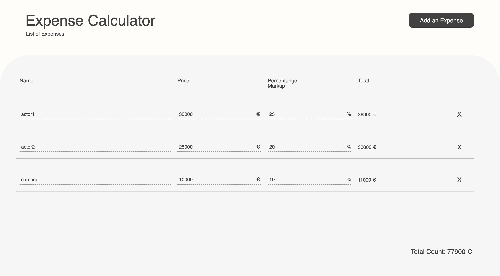
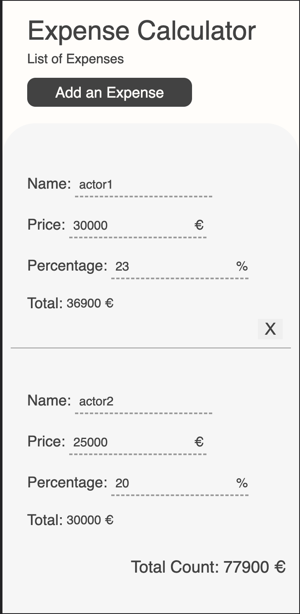
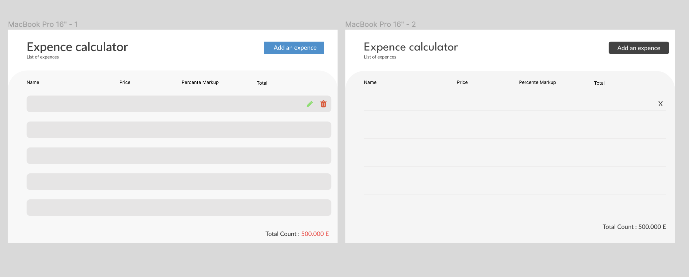

# Expense Calculator

This project is designed to facilitate the calculation and modification of multiple expenses for film producers.





## Run Locally

Clone the project

  

```bash

git clone https://github.com/bircankut/expense-calculator

```

  

Go to the project directory

  

```bash

cd expence-calculator

```

  

Install dependencies

  

```bash

yarn install

```

  

Start the development server

  

```bash

yarn dev

```

## Overall Structure
The project structure includes a "src" directory, which serves as the main source code location. Within the "src" directory, there is a "components" folder that organizes related components into their respective folders to ensure a clear and organized structure.

Additionally, the project incorporates an "expense" context to improve prop handling. The "types" folder contains an interface for expenses, allowing for better type checking. Furthermore, there is a "utils" folder that includes a calculation function for determining the total expense amount. This folder also contains an ID generator for expense IDs. Lastly, there are enum files for button color variants, specifically for color enums.

## State Management
The project features three important states that contribute to its functionality. Firstly, we have the "showModal" state, which controls the visibility of modal component, enhancing user interaction and experience.

The most crucial state is the "wipExpense" state. It serves as an object that represents the expense currently being worked on, providing a central point for managing and manipulating expense data during the project.

Lastly, we have the "expenses" state, which is an array that holds all the completed expenses. This state acts as a repository for storing and accessing expenses, ensuring efficient organization and retrieval of expense data throughout the project.

## bignumber.js
We leveraged the power of "bignumber.js" to simplify complex calculations involving large numbers, while also enhancing our ability to handle fractional numbers with ease. By utilizing this library, we were able to streamline the process of performing intricate calculations, making them more manageable and accurate, especially when dealing with significant numerical values. Additionally, "bignumber.js" facilitated smoother handling of fractional calculations, enabling us to achieve more precise results in our mathematical operations.

## UI



The initial concept of the project was captured in the first picture, serving as the foundation for further development. However, recognizing the need for a more streamlined and cohesive structure, a simpler and more harmonious design approach was adopted. 

The user interface has been meticulously crafted with an emphasis on simplicity and user-friendliness, with the primary objective of reducing confusion. Within the listing section, a provision has been made to incorporate editable inputs for expense properties, granting users convenient access to modify specific inputs as needed. To ensure a seamless user experience, the expense section has been designed to be scrollable independently, while simultaneously maintaining the constant visibility of the header and total count. Additionally, in consideration of users' inherent inclination to click on the right side, the add button has been strategically positioned on the right for effortless accessibility.

## Task Management
Upon initially reviewing the project requirements, my initial approach was to establish an expense object and an expense array. To ensure a well-structured development process, I prioritized building the frontend components before tackling the dynamic aspects of the project.

To enhance user interaction, I implemented modal logic to access the "Add" button functionality. Initially, I considered managing the states through propagation, but as the project evolved, I realized the need for a more comprehensive context logic, which led to a slightly more complex implementation. Nevertheless, this decision ensured a cleaner and more user-friendly project.

Once all the necessary functionalities were implemented, I focused on incorporating responsive design into the project, making it adaptable and accessible across different devices and screen sizes.

## Authors
- [@bircankut](https://www.github.com/bircankut)